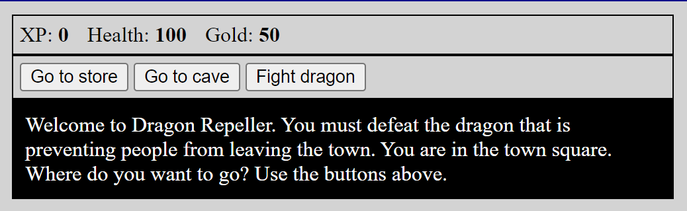

# Dragon Repeller

## Description
Welcome to Dragon Repeller. You must defeat the dragon that is preventing people from leaving the town. You are in the town square. Where do you want to go? Use the buttons above.
Dragon Repeller is a simple browser-based game built using HTML, CSS, and JavaScript. This project was created as part of my learning experience with [FreeCodeCamp](https://github.com/freeCodeCamp) and their tutorial -Full Stack Web Development for Beginners (Full Course on HTML, CSS, JavaScript, Node.js, MongoDB)-. You can check out the tutorial [here](https://www.youtube.com/watch?v=nu_pCVPKzTk).
## Features:
- Dynamic Scoring: Real-time score tracking based on the player's interactions.
## What I Learned:
- Structuring content using **HTML**
- Styling elements with **CSS**
- Implementing game logic and handling events with **JavaScript**
## Future Enhancements:
- Add multiple levels and increased difficulty
- Improve visuals and animations
- Add sound effects and additional game features
## Getting Started:
1. Clone the repository:
   ```bash
   git clone https://github.com/mi7773/dragon-repeller.git
   ```
2. Open the `index.html` file in your browser to start playing.
Or, Or, visit the game directly [here](https://mi7773.github.io/dragon_repeller/).
## Contributions
Contributions are welcome! Feel free to fork the project, submit issues, or suggest features.
